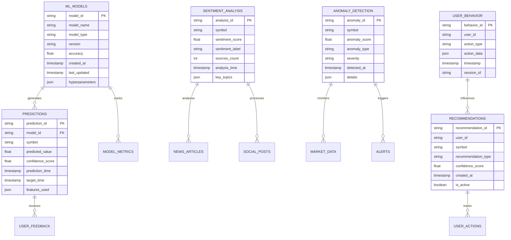

# Yapay Zeka Entegrasyonu ve Süreç Optimizasyonu Stratejisi

## 1. Proje Genel Bakış

Borsa analiz sistemi için kapsamlı yapay zeka entegrasyonu stratejisi. Machine learning, doğal dil işleme, otomatik karar verme ve akıllı veri analizi teknolojilerini kullanarak finansal tahmin doğruluğunu artırır ve kullanıcı deneyimini optimize eder.

## 2. Temel Özellikler

### 2.1 AI Bileşenleri

Sistemde entegre edilecek yapay zeka bileşenleri:

1. **Finansal Tahmin Modelleri**: LSTM, GRU ve Transformer tabanlı fiyat tahmin modelleri
2. **Sentiment Analizi**: Haber ve sosyal medya verilerinden duygu analizi
3. **Otomatik Karar Verme**: Risk değerlendirmesi ve yatırım önerisi sistemleri
4. **Akıllı Veri İşleme**: Pattern recognition ve anomali tespiti
5. **Kullanıcı Deneyimi AI**: Kişiselleştirilmiş dashboard ve öneriler
6. **Tahmine Dayalı Analitik**: Piyasa trend analizi ve volatilite tahmini
7. **Otomatik Ticaret Önerileri**: AI destekli alım-satım sinyalleri
8. **Gerçek Zamanlı Anomali Tespiti**: Anormal piyasa hareketlerinin tespiti
9. **Akıllı Önbellekleme**: AI tabanlı cache optimizasyonu

### 2.2 Sayfa Detayları

| Sayfa Adı | Modül Adı | Özellik Açıklaması |
|-----------|-----------|--------------------|
| **AI Dashboard** | Tahmin Modelleri | LSTM/GRU tabanlı fiyat tahminleri, güven aralıkları, model performans metrikleri |
| **AI Dashboard** | Sentiment Analizi | Haber sentiment skorları, sosyal medya duygu analizi, piyasa sentiment göstergeleri |
| **AI Dashboard** | Risk Analizi | Portföy risk skorları, VaR hesaplamaları, stress test sonuçları |
| **Akıllı Öneriler** | Yatırım Tavsiyeleri | AI destekli alım-satım önerileri, risk-getiri optimizasyonu, portföy önerileri |
| **Akıllı Öneriler** | Kişiselleştirme | Kullanıcı davranış analizi, kişisel yatırım profili, özelleştirilmiş içerik |
| **Anomali Tespiti** | Gerçek Zamanlı İzleme | Anormal fiyat hareketleri, hacim anomalileri, piyasa manipülasyon tespiti |
| **Anomali Tespiti** | Alert Sistemi | Otomatik uyarılar, threshold tabanlı bildirimler, kritik seviye alarmları |
| **Performans Analizi** | Model Metrikleri | Tahmin doğruluğu, MAE/RMSE skorları, model karşılaştırmaları |
| **Performans Analizi** | Sistem Optimizasyonu | AI destekli cache yönetimi, query optimizasyonu, resource allocation |

## 3. Temel Süreç

### 3.1 AI Veri İşleme Akışı


### 3.2 Gerçek Zamanlı AI Pipeline


## 4. Kullanıcı Arayüzü Tasarımı

### 4.1 Tasarım Stili

- **Ana Renkler**: AI temalı mavi tonları (#1E3A8A, #3B82F6), başarı için yeşil (#10B981)
- **Buton Stili**: Gradient efektli, AI-inspired tasarım
- **Font**: Inter font ailesi, 14px-18px arası boyutlar
- **Layout**: Card-based tasarım, AI dashboard layout
- **İkonlar**: AI ve teknoloji temalı ikonlar, animasyonlu göstergeler

### 4.2 Sayfa Tasarım Genel Bakışı

| Sayfa Adı | Modül Adı | UI Elementleri |
|-----------|-----------|----------------|
| **AI Dashboard** | Tahmin Modelleri | Interactive charts, confidence intervals, model accuracy indicators, real-time updates |
| **AI Dashboard** | Sentiment Analizi | Sentiment gauges, news feed integration, social media sentiment widgets |
| **Akıllı Öneriler** | Yatırım Tavsiyeleri | AI recommendation cards, risk-return scatter plots, portfolio optimization tools |
| **Anomali Tespiti** | Gerçek Zamanlı İzleme | Alert panels, anomaly heatmaps, real-time notification system |

### 4.3 Responsive Tasarım

Mobile-first yaklaşım ile AI dashboard'ların tablet ve mobil cihazlarda optimize edilmiş görünümü. Touch-friendly AI kontrolleri ve gesture-based navigation.

## 5. Teknik Mimari

### 5.1 AI Sistem Mimarisi


### 5.2 Teknoloji Açıklaması

- **Frontend**: React@18 + TypeScript + TailwindCSS + Chart.js
- **AI Backend**: Python + FastAPI + TensorFlow + PyTorch
- **ML Pipeline**: Apache Airflow + MLflow + Kubeflow
- **Data Storage**: PostgreSQL + Redis + InfluxDB
- **Model Serving**: TensorFlow Serving + ONNX Runtime
- **Monitoring**: Prometheus + Grafana + MLflow Tracking

### 5.3 Route Tanımları

| Route | Amaç |
|-------|-------|
| `/ai-dashboard` | AI destekli ana dashboard, tahmin modelleri ve sentiment analizi |
| `/ai-recommendations` | Kişiselleştirilmiş yatırım önerileri ve portföy optimizasyonu |
| `/anomaly-detection` | Gerçek zamanlı anomali tespiti ve uyarı sistemi |
| `/model-performance` | ML model performans metrikleri ve karşılaştırmaları |
| `/ai-settings` | AI model ayarları ve kişiselleştirme tercihleri |

## 6. API Tanımları

### 6.1 Temel AI API'leri

**Fiyat Tahmin API**
```
POST /api/ai/predict-price
```

İstek:
| Parametre | Tip | Zorunlu | Açıklama |
|-----------|-----|---------|----------|
| symbol | string | true | Hisse senedi kodu |
| timeframe | string | true | Tahmin zaman dilimi (1d, 1w, 1m) |
| model_type | string | false | Model tipi (lstm, gru, transformer) |

Yanıt:
| Parametre | Tip | Açıklama |
|-----------|-----|----------|
| prediction | number | Tahmin edilen fiyat |
| confidence | number | Güven aralığı (0-1) |
| model_accuracy | number | Model doğruluğu |

**Sentiment Analizi API**
```
POST /api/ai/sentiment-analysis
```

İstek:
| Parametre | Tip | Zorunlu | Açıklama |
|-----------|-----|---------|----------|
| symbol | string | true | Hisse senedi kodu |
| source | string | false | Veri kaynağı (news, social, all) |
| timeframe | string | false | Zaman dilimi (1h, 1d, 1w) |

Yanıt:
```json
{
  "sentiment_score": 0.75,
  "sentiment_label": "positive",
  "confidence": 0.89,
  "sources_analyzed": 150,
  "key_topics": ["earnings", "growth", "market"]
}
```

**Anomali Tespiti API**
```
GET /api/ai/anomaly-detection/{symbol}
```

Yanıt:
```json
{
  "anomalies_detected": true,
  "anomaly_score": 0.85,
  "anomaly_type": "price_spike",
  "timestamp": "2024-01-15T10:30:00Z",
  "severity": "high",
  "description": "Unusual price movement detected"
}
```

## 7. Sunucu Mimarisi

### 7.1 AI Mikroservis Mimarisi


### 7.2 AI Model Deployment


## 8. Veri Modeli

### 8.1 AI Veri Yapıları



### 8.2 Veri Tanımlama Dili (DDL)

**ML Models Tablosu**
```sql
CREATE TABLE ml_models (
    model_id UUID PRIMARY KEY DEFAULT gen_random_uuid(),
    model_name VARCHAR(100) NOT NULL,
    model_type VARCHAR(50) NOT NULL,
    version VARCHAR(20) NOT NULL,
    accuracy DECIMAL(5,4),
    created_at TIMESTAMP WITH TIME ZONE DEFAULT NOW(),
    last_updated TIMESTAMP WITH TIME ZONE DEFAULT NOW(),
    hyperparameters JSONB,
    is_active BOOLEAN DEFAULT true
);

CREATE INDEX idx_ml_models_type ON ml_models(model_type);
CREATE INDEX idx_ml_models_active ON ml_models(is_active);
```

**Predictions Tablosu**
```sql
CREATE TABLE predictions (
    prediction_id UUID PRIMARY KEY DEFAULT gen_random_uuid(),
    model_id UUID REFERENCES ml_models(model_id),
    symbol VARCHAR(10) NOT NULL,
    predicted_value DECIMAL(15,4) NOT NULL,
    confidence_score DECIMAL(5,4) NOT NULL,
    prediction_time TIMESTAMP WITH TIME ZONE DEFAULT NOW(),
    target_time TIMESTAMP WITH TIME ZONE NOT NULL,
    features_used JSONB,
    actual_value DECIMAL(15,4),
    prediction_error DECIMAL(15,4)
);

CREATE INDEX idx_predictions_symbol ON predictions(symbol);
CREATE INDEX idx_predictions_time ON predictions(prediction_time DESC);
CREATE INDEX idx_predictions_model ON predictions(model_id);
```

**Sentiment Analysis Tablosu**
```sql
CREATE TABLE sentiment_analysis (
    analysis_id UUID PRIMARY KEY DEFAULT gen_random_uuid(),
    symbol VARCHAR(10) NOT NULL,
    sentiment_score DECIMAL(5,4) NOT NULL,
    sentiment_label VARCHAR(20) NOT NULL,
    sources_count INTEGER DEFAULT 0,
    analysis_time TIMESTAMP WITH TIME ZONE DEFAULT NOW(),
    key_topics JSONB,
    data_source VARCHAR(50)
);

CREATE INDEX idx_sentiment_symbol ON sentiment_analysis(symbol);
CREATE INDEX idx_sentiment_time ON sentiment_analysis(analysis_time DESC);
```

**Anomaly Detection Tablosu**
```sql
CREATE TABLE anomaly_detection (
    anomaly_id UUID PRIMARY KEY DEFAULT gen_random_uuid(),
    symbol VARCHAR(10) NOT NULL,
    anomaly_score DECIMAL(5,4) NOT NULL,
    anomaly_type VARCHAR(50) NOT NULL,
    severity VARCHAR(20) NOT NULL CHECK (severity IN ('low', 'medium', 'high', 'critical')),
    detected_at TIMESTAMP WITH TIME ZONE DEFAULT NOW(),
    details JSONB,
    is_resolved BOOLEAN DEFAULT false,
    resolved_at TIMESTAMP WITH TIME ZONE
);

CREATE INDEX idx_anomaly_symbol ON anomaly_detection(symbol);
CREATE INDEX idx_anomaly_severity ON anomaly_detection(severity);
CREATE INDEX idx_anomaly_time ON anomaly_detection(detected_at DESC);
```

**User Behavior Tablosu**
```sql
CREATE TABLE user_behavior (
    behavior_id UUID PRIMARY KEY DEFAULT gen_random_uuid(),
    user_id UUID NOT NULL,
    action_type VARCHAR(50) NOT NULL,
    action_data JSONB,
    timestamp TIMESTAMP WITH TIME ZONE DEFAULT NOW(),
    session_id VARCHAR(100),
    ip_address INET,
    user_agent TEXT
);

CREATE INDEX idx_user_behavior_user ON user_behavior(user_id);
CREATE INDEX idx_user_behavior_time ON user_behavior(timestamp DESC);
CREATE INDEX idx_user_behavior_action ON user_behavior(action_type);
```

**Recommendations Tablosu**
```sql
CREATE TABLE recommendations (
    recommendation_id UUID PRIMARY KEY DEFAULT gen_random_uuid(),
    user_id UUID NOT NULL,
    symbol VARCHAR(10) NOT NULL,
    recommendation_type VARCHAR(50) NOT NULL,
    confidence_score DECIMAL(5,4) NOT NULL,
    created_at TIMESTAMP WITH TIME ZONE DEFAULT NOW(),
    expires_at TIMESTAMP WITH TIME ZONE,
    is_active BOOLEAN DEFAULT true,
    user_feedback INTEGER CHECK (user_feedback BETWEEN 1 AND 5),
    recommendation_data JSONB
);

CREATE INDEX idx_recommendations_user ON recommendations(user_id);
CREATE INDEX idx_recommendations_symbol ON recommendations(symbol);
CREATE INDEX idx_recommendations_active ON recommendations(is_active);
```

**Başlangıç Verileri**
```sql
-- Örnek ML modelleri
INSERT INTO ml_models (model_name, model_type, version, accuracy, hyperparameters) VALUES
('LSTM Price Predictor', 'lstm', '1.0.0', 0.8750, '{"layers": 3, "units": 128, "dropout": 0.2}'),
('GRU Volatility Model', 'gru', '1.0.0', 0.8200, '{"layers": 2, "units": 64, "dropout": 0.3}'),
('Transformer Trend Model', 'transformer', '1.0.0', 0.9100, '{"heads": 8, "layers": 6, "d_model": 512}'),
('BERT Sentiment Analyzer', 'bert', '1.0.0', 0.9300, '{"max_length": 512, "learning_rate": 2e-5}');

-- Örnek anomali tespiti kuralları
INSERT INTO anomaly_detection (symbol, anomaly_score, anomaly_type, severity, details) VALUES
('ASELS', 0.95, 'price_spike', 'high', '{"price_change": 15.5, "volume_change": 300, "time_window": "5min"}'),
('ASELS', 0.75, 'volume_anomaly', 'medium', '{"volume_ratio": 5.2, "avg_volume": 1000000, "current_volume": 5200000}');
```

## 9. AI Entegrasyon Yol Haritası

### 9.1 Faz 1: Temel AI Altyapısı (1-2 Ay)
- ML model serving altyapısı kurulumu
- Temel fiyat tahmin modelleri (LSTM/GRU)
- Veri pipeline ve feature engineering
- Model monitoring ve logging sistemi

### 9.2 Faz 2: Sentiment Analizi (2-3 Ay)
- Haber ve sosyal medya veri toplama
- NLP pipeline kurulumu
- BERT tabanlı sentiment modelleri
- Real-time sentiment scoring

### 9.3 Faz 3: Anomali Tespiti (3-4 Ay)
- Real-time data streaming
- Anomali tespit algoritmaları
- Alert ve notification sistemi
- Dashboard entegrasyonu

### 9.4 Faz 4: Kişiselleştirme (4-5 Ay)
- Kullanıcı davranış analizi
- Recommendation engine
- A/B testing framework
- Personalized dashboard

### 9.5 Faz 5: Gelişmiş AI Özellikleri (5-6 Ay)
- Transformer tabanlı modeller
- Multi-modal learning
- AutoML pipeline
- Advanced portfolio optimization

## 10. Performans ve Monitoring

### 10.1 AI Model Metrikleri
- **Tahmin Doğruluğu**: MAE, RMSE, MAPE
- **Sentiment Doğruluğu**: Precision, Recall, F1-Score
- **Anomali Tespiti**: True/False Positive Rate
- **Recommendation Quality**: Click-through Rate, Conversion Rate

### 10.2 Sistem Performans Metrikleri
- **Model Inference Time**: <100ms
- **API Response Time**: <200ms
- **Model Accuracy Threshold**: >85%
- **System Uptime**: >99.9%

### 10.3 Monitoring Dashboard
- Real-time model performance tracking
- Data drift detection
- Model degradation alerts
- Resource utilization monitoring

Bu kapsamlı AI entegrasyon stratejisi, borsa analiz sistemini modern yapay zeka teknolojileri ile güçlendirerek kullanıcılara daha akıllı, doğru ve kişiselleştirilmiş finansal analiz deneyimi sunmaktadır.