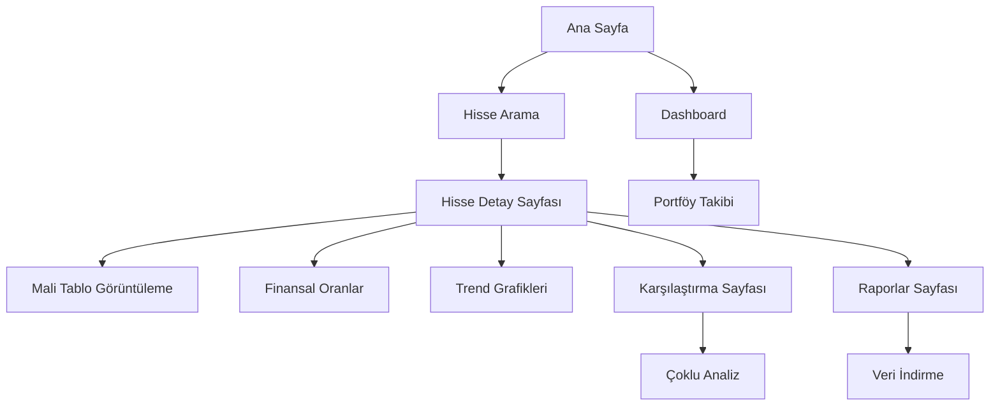

# Borsa Hisse Mali Tablo Analiz Sistemi - Ürün Gereksinimleri

## 1. Ürün Genel Bakışı

Türk borsasında işlem gören şirketlerin mali tablo verilerini gerçek zamanlı olarak çeken, analiz eden ve finansal hesaplamalar yapan dinamik web uygulaması. Sistem İş Yatırım web sitesinden veri çekerek yatırımcılara kapsamlı finansal analiz imkanı sunar.

Sistem, hisse senedi yatırımcılarının bilinçli karar vermelerine yardımcı olmak için mali tablo verilerini otomatik olarak toplar ve analiz eder. Hedef kullanıcılar bireysel yatırımcılar, finansal analistler ve portföy yöneticileridir.

## 2. Temel Özellikler

### 2.1 Kullanıcı Rolleri

| Rol | Kayıt Yöntemi | Temel Yetkiler |
|-----|---------------|----------------|
| Misafir Kullanıcı | Kayıt gerektirmez | Temel hisse verilerini görüntüleme, sınırlı analiz |
| Kayıtlı Kullanıcı | E-posta ile kayıt | Tüm analiz araçları, veri indirme, karşılaştırma |
| Premium Kullanıcı | Ücretli abonelik | Gelişmiş analizler, API erişimi, özel raporlar |

### 2.2 Özellik Modülü

Sistemimiz aşağıdaki ana sayfalardan oluşmaktadır:

1. **Ana Sayfa**: Hisse arama, popüler hisseler listesi, piyasa özeti
2. **Hisse Detay Sayfası**: Mali tablo verileri, hesaplanmış oranlar, trend grafikleri
3. **Karşılaştırma Sayfası**: Çoklu hisse karşılaştırma, sektör analizi
4. **Dashboard**: Kişisel portföy takibi, favori hisseler, uyarılar
5. **Raporlar Sayfası**: PDF/Excel export, özel raporlar
6. **Kullanıcı Profili**: Hesap ayarları, abonelik yönetimi

### 2.3 Sayfa Detayları

| Sayfa Adı | Modül Adı | Özellik Açıklaması |
|-----------|-----------|--------------------|
| Ana Sayfa | Hisse Arama | Hisse kodu ile arama, otomatik tamamlama, popüler hisseler |
| Ana Sayfa | Piyasa Özeti | BIST 100 endeksi, günlük kazananlar/kaybedenler |
| Hisse Detay | Mali Tablo Görüntüleme | Çeyreklik/yıllık veriler, 5 yıllık geçmiş, tablo formatında |
| Hisse Detay | Finansal Oranlar | Net işletme sermayesi, nakit durumu, mali yapı hesaplamaları |
| Hisse Detay | Trend Grafikleri | İnteraktif grafikler, zaman serisi analizi, karşılaştırma |
| Karşılaştırma | Çoklu Analiz | 2-5 hisse arasında karşılaştırma, yan yana görüntüleme |
| Dashboard | Portföy Takibi | Favori hisseler, fiyat uyarıları, performans özeti |
| Raporlar | Veri İndirme | Excel/PDF formatında rapor oluşturma ve indirme |

## 3. Temel Süreçler

**Ana Kullanıcı Akışı:**
Kullanıcı ana sayfada hisse kodu arar → Hisse detay sayfasına yönlendirilir → Mali tablo verilerini inceler → Hesaplanmış oranları görüntüler → Trend grafiklerini analiz eder → İsteğe bağlı olarak diğer hisselerle karşılaştırma yapar → Rapor indirir

**Kayıtlı Kullanıcı Akışı:**
Giriş yapar → Dashboard'da favori hisselerini görür → Yeni hisse ekler → Detaylı analiz yapar → Portföyüne ekler → Uyarı kurar



## 4. Kullanıcı Arayüzü Tasarımı

### 4.1 Tasarım Stili

- **Ana Renkler**: Koyu mavi (#1e3a8a), açık mavi (#3b82f6), beyaz (#ffffff)
- **İkincil Renkler**: Yeşil (#10b981) pozitif değerler, kırmızı (#ef4444) negatif değerler
- **Buton Stili**: Yuvarlatılmış köşeler (8px), gölge efekti, hover animasyonları
- **Font**: Inter font ailesi, başlıklar için 24px, içerik için 16px
- **Layout**: Kart tabanlı tasarım, üst navigasyon menüsü, sidebar filtreleme
- **İkonlar**: Feather icons seti, finansal semboller için özel ikonlar

### 4.2 Sayfa Tasarım Özeti

| Sayfa Adı | Modül Adı | UI Elementleri |
|-----------|-----------|----------------|
| Ana Sayfa | Hisse Arama | Büyük arama kutusu, otomatik tamamlama dropdown, trend kartları |
| Hisse Detay | Mali Tablo | Responsive tablo, sıralama, filtreleme, renk kodlaması |
| Hisse Detay | Grafik Görüntüleme | Chart.js ile interaktif grafikler, zoom, tooltip |
| Dashboard | Portföy Kartları | Grid layout, performans göstergeleri, renk kodlu değişimler |

### 4.3 Responsive Tasarım

Mobile-first yaklaşım ile tasarlanmış, tablet ve desktop için optimize edilmiş. Touch etkileşimleri için büyük butonlar ve kolay navigasyon. Tüm modern tarayıcılarda uyumlu.

## 5. Veri Gereksinimleri

### 5.1 Çekilecek Mali Tablo Verileri

1. **Dönen Varlıklar** - Şirketin kısa vadeli varlıkları
2. **Kısa Vadeli Yükümlülükler** - Bir yıl içinde ödenecek borçlar
3. **Nakit ve Nakit Benzerleri** - Likit varlıklar
4. **Finansal Yatırımlar** - Menkul kıymet yatırımları
5. **Finansal Borçlar** - Banka kredileri ve finansal yükümlülükler
6. **Toplam Varlıklar** - Şirketin tüm varlıkları
7. **Toplam Yükümlülükler** - Şirketin tüm borçları
8. **FAVÖK (EBITDA)** - Faiz, vergi, amortisman öncesi kar
9. **Net Dönem Karı/Zararı** - Dönem net sonucu
10. **Özkaynaklar** - Şirket sahiplerinin hakları
11. **Ödenmiş Sermaye** - Şirketin çıkarılmış sermayesi

### 5.2 Hesaplama Formülleri

**Net İşletme Sermayesi:**
```
NET İŞLETME SERMAYESİ = Dönen Varlıklar - Kısa Vadeli Yükümlülükler
```

**Nakit Durumu:**
```
NAKİT DURUMU = (Nakit ve Nakit Benzerleri + Finansal Yatırımlar) - Finansal Borçlar
```

**Mali Yapı:**
```
MALİ YAPI = Toplam Varlıklar - Toplam Yükümlülükler
```

**FAVÖK Karlılığı:**
```
FAVÖK KARLILIK = FAVÖK / Net Dönem Karı
```

**Bedelsiz Potansiyeli:**
```
BEDELSİZ POTANSİYELİ = Özkaynaklar / Ödenmiş Sermaye
```

## 6. Performans ve Güvenlik Gereksinimleri

### 6.1 Performans
- Sayfa yükleme süresi maksimum 3 saniye
- API yanıt süresi maksimum 500ms
- Eş zamanlı 1000 kullanıcı desteği
- Veri güncelleme sıklığı: günde 4 kez (piyasa açılış/kapanış saatleri)

### 6.2 Güvenlik
- HTTPS zorunlu
- JWT tabanlı kimlik doğrulama
- Rate limiting: kullanıcı başına dakikada 100 istek
- Veri şifreleme ve güvenli saklama
- GDPR uyumlu veri işleme