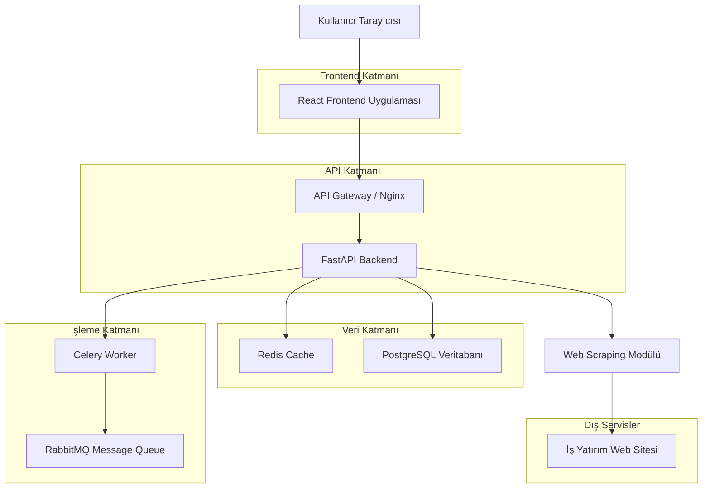
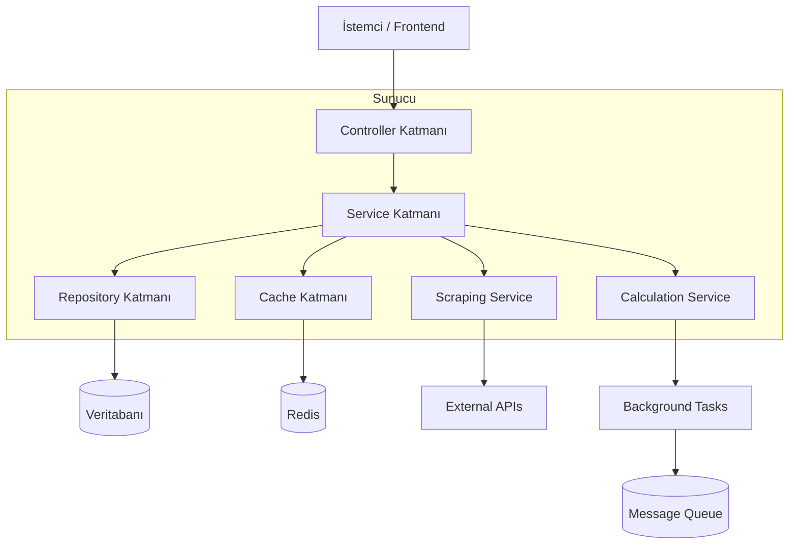
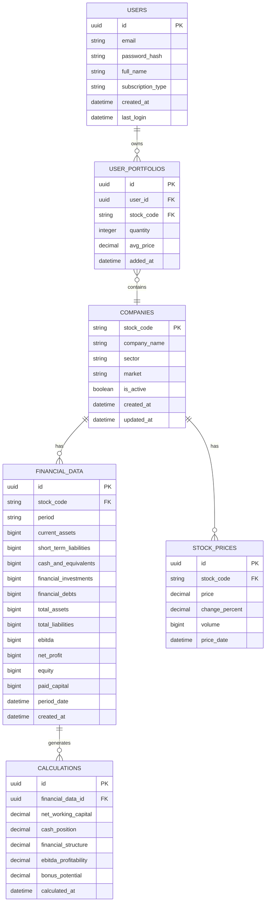

# Borsa Hisse Mali Tablo Analiz Sistemi - Teknik Mimari

## 1. Mimari Tasarım



## 2. Teknoloji Açıklaması

- **Frontend**: React@18 + TypeScript + Tailwind CSS + Vite
- **Backend**: FastAPI + Python 3.11 + Pydantic + SQLAlchemy
- **Veritabanı**: PostgreSQL 15 + Redis 7 (cache)
- **Message Queue**: RabbitMQ + Celery (async tasks)
- **Web Scraping**: Selenium + BeautifulSoup4 + Requests
- **Containerization**: Docker + Docker Compose
- **Monitoring**: Prometheus + Grafana

## 3. Route Tanımları

| Route | Amaç |
|-------|-------|
| / | Ana sayfa, hisse arama ve piyasa özeti |
| /stock/:code | Hisse detay sayfası, mali tablo ve analizler |
| /compare | Çoklu hisse karşılaştırma sayfası |
| /dashboard | Kullanıcı dashboard'u, portföy takibi |
| /reports | Rapor oluşturma ve indirme sayfası |
| /profile | Kullanıcı profil ve ayarlar sayfası |
| /login | Kullanıcı giriş sayfası |
| /register | Kullanıcı kayıt sayfası |

## 4. API Tanımları

### 4.1 Temel API Endpoints

**Hisse Senedi Verileri**
```
GET /api/v1/stocks/{stock_code}/financial-data
```

İstek:
| Parametre Adı | Parametre Tipi | Zorunlu | Açıklama |
|---------------|----------------|---------|----------|
| stock_code | string | true | Hisse senedi kodu (örn: THYAO) |
| period | string | false | Dönem (quarterly/yearly) |
| years | integer | false | Kaç yıllık veri (varsayılan: 5) |

Yanıt:
| Parametre Adı | Parametre Tipi | Açıklama |
|---------------|----------------|-----------|
| success | boolean | İşlem durumu |
| data | object | Mali tablo verileri |
| last_updated | datetime | Son güncelleme zamanı |

Örnek:
```json
{
  "success": true,
  "data": {
    "stock_code": "THYAO",
    "company_name": "Türk Hava Yolları A.O.",
    "financial_data": [
      {
        "period": "2024-Q3",
        "current_assets": 45000000000,
        "short_term_liabilities": 35000000000,
        "cash_and_equivalents": 12000000000,
        "financial_investments": 3000000000,
        "financial_debts": 25000000000,
        "total_assets": 85000000000,
        "total_liabilities": 60000000000,
        "ebitda": 8000000000,
        "net_profit": 2000000000,
        "equity": 25000000000,
        "paid_capital": 15000000000
      }
    ]
  },
  "last_updated": "2024-01-15T10:30:00Z"
}
```

**Finansal Hesaplamalar**
```
GET /api/v1/stocks/{stock_code}/calculations
```

İstek:
| Parametre Adı | Parametre Tipi | Zorunlu | Açıklama |
|---------------|----------------|---------|----------|
| stock_code | string | true | Hisse senedi kodu |
| calculation_type | string | false | Hesaplama tipi (all/specific) |

Yanıt:
| Parametre Adı | Parametre Tipi | Açıklama |
|---------------|----------------|-----------|
| net_working_capital | number | Net işletme sermayesi |
| cash_position | number | Nakit durumu |
| financial_structure | number | Mali yapı |
| ebitda_profitability | number | FAVÖK karlılığı |
| bonus_potential | number | Bedelsiz potansiyeli |

**Veri Yenileme**
```
POST /api/v1/stocks/{stock_code}/refresh
```

**Hisse Listesi**
```
GET /api/v1/stocks/list
```

**Kullanıcı Kimlik Doğrulama**
```
POST /api/v1/auth/login
POST /api/v1/auth/register
POST /api/v1/auth/logout
GET /api/v1/auth/profile
```

### 4.2 WebSocket Kanalları

```
/ws/stock/{stock_code}/updates - Gerçek zamanlı hisse güncellemeleri
/ws/calculations/live - Canlı hesaplama sonuçları
/ws/market/summary - Piyasa özeti güncellemeleri
```

## 5. Sunucu Mimarisi Diyagramı



## 6. Veri Modeli

### 6.1 Veri Modeli Tanımı



### 6.2 Veri Tanımlama Dili (DDL)

**Şirketler Tablosu (companies)**
```sql
-- Tablo oluşturma
CREATE TABLE companies (
    stock_code VARCHAR(10) PRIMARY KEY,
    company_name VARCHAR(255) NOT NULL,
    sector VARCHAR(100),
    market VARCHAR(50) DEFAULT 'BIST',
    is_active BOOLEAN DEFAULT true,
    created_at TIMESTAMP WITH TIME ZONE DEFAULT NOW(),
    updated_at TIMESTAMP WITH TIME ZONE DEFAULT NOW()
);

-- İndeks oluşturma
CREATE INDEX idx_companies_sector ON companies(sector);
CREATE INDEX idx_companies_market ON companies(market);
CREATE INDEX idx_companies_active ON companies(is_active);

-- Başlangıç verileri
INSERT INTO companies (stock_code, company_name, sector, market) VALUES
('THYAO', 'Türk Hava Yolları A.O.', 'Ulaştırma', 'BIST'),
('AKBNK', 'Akbank T.A.Ş.', 'Bankacılık', 'BIST'),
('BIMAS', 'BİM Birleşik Mağazalar A.Ş.', 'Perakende', 'BIST'),
('TCELL', 'Turkcell İletişim Hizmetleri A.Ş.', 'Telekomünikasyon', 'BIST'),
('EREGL', 'Ereğli Demir ve Çelik Fabrikaları T.A.Ş.', 'Metal Ana Sanayi', 'BIST');
```

**Mali Tablo Verileri Tablosu (financial_data)**
```sql
-- Tablo oluşturma
CREATE TABLE financial_data (
    id UUID PRIMARY KEY DEFAULT gen_random_uuid(),
    stock_code VARCHAR(10) REFERENCES companies(stock_code),
    period VARCHAR(20) NOT NULL,
    current_assets BIGINT,
    short_term_liabilities BIGINT,
    cash_and_equivalents BIGINT,
    financial_investments BIGINT,
    financial_debts BIGINT,
    total_assets BIGINT,
    total_liabilities BIGINT,
    ebitda BIGINT,
    net_profit BIGINT,
    equity BIGINT,
    paid_capital BIGINT,
    period_date DATE NOT NULL,
    created_at TIMESTAMP WITH TIME ZONE DEFAULT NOW(),
    UNIQUE(stock_code, period, period_date)
);

-- İndeks oluşturma
CREATE INDEX idx_financial_data_stock_code ON financial_data(stock_code);
CREATE INDEX idx_financial_data_period_date ON financial_data(period_date DESC);
CREATE INDEX idx_financial_data_period ON financial_data(period);
```

**Hesaplamalar Tablosu (calculations)**
```sql
-- Tablo oluşturma
CREATE TABLE calculations (
    id UUID PRIMARY KEY DEFAULT gen_random_uuid(),
    financial_data_id UUID REFERENCES financial_data(id),
    net_working_capital DECIMAL(20,2),
    cash_position DECIMAL(20,2),
    financial_structure DECIMAL(20,2),
    ebitda_profitability DECIMAL(10,4),
    bonus_potential DECIMAL(10,4),
    calculated_at TIMESTAMP WITH TIME ZONE DEFAULT NOW()
);

-- İndeks oluşturma
CREATE INDEX idx_calculations_financial_data_id ON calculations(financial_data_id);
CREATE INDEX idx_calculations_calculated_at ON calculations(calculated_at DESC);
```

**Kullanıcılar Tablosu (users)**
```sql
-- Tablo oluşturma
CREATE TABLE users (
    id UUID PRIMARY KEY DEFAULT gen_random_uuid(),
    email VARCHAR(255) UNIQUE NOT NULL,
    password_hash VARCHAR(255) NOT NULL,
    full_name VARCHAR(255) NOT NULL,
    subscription_type VARCHAR(20) DEFAULT 'free' CHECK (subscription_type IN ('free', 'premium')),
    created_at TIMESTAMP WITH TIME ZONE DEFAULT NOW(),
    last_login TIMESTAMP WITH TIME ZONE
);

-- İndeks oluşturma
CREATE INDEX idx_users_email ON users(email);
CREATE INDEX idx_users_subscription ON users(subscription_type);
```

**Kullanıcı Portföyleri Tablosu (user_portfolios)**
```sql
-- Tablo oluşturma
CREATE TABLE user_portfolios (
    id UUID PRIMARY KEY DEFAULT gen_random_uuid(),
    user_id UUID REFERENCES users(id),
    stock_code VARCHAR(10) REFERENCES companies(stock_code),
    quantity INTEGER DEFAULT 0,
    avg_price DECIMAL(10,2),
    added_at TIMESTAMP WITH TIME ZONE DEFAULT NOW(),
    UNIQUE(user_id, stock_code)
);

-- İndeks oluşturma
CREATE INDEX idx_user_portfolios_user_id ON user_portfolios(user_id);
CREATE INDEX idx_user_portfolios_stock_code ON user_portfolios(stock_code);
```

## 7. Güvenlik ve Performans Optimizasyonları

### 7.1 Güvenlik Önlemleri
- JWT token tabanlı kimlik doğrulama
- CORS policy implementasyonu
- Rate limiting (kullanıcı başına dakikada 100 istek)
- Input validation ve sanitization
- SQL injection koruması
- XSS koruması

### 7.2 Performans Optimizasyonları
- Redis cache kullanımı (sık erişilen veriler için)
- Database connection pooling
- Async/await pattern kullanımı
- CDN kullanımı (static dosyalar için)
- Database indexing stratejisi
- Lazy loading (frontend)

### 7.3 Monitoring ve Logging
- Prometheus metrics collection
- Grafana dashboard
- Structured logging (JSON format)
- Error tracking (Sentry entegrasyonu)
- Health check endpoints
- Performance monitoring

## 8. Deployment Stratejisi

### 8.1 Containerization
```dockerfile
# Backend Dockerfile örneği
FROM python:3.11-slim
WORKDIR /app
COPY requirements.txt .
RUN pip install -r requirements.txt
COPY . .
EXPOSE 8000
CMD ["uvicorn", "main:app", "--host", "0.0.0.0", "--port", "8000"]
```

### 8.2 Docker Compose
```yaml
version: '3.8'
services:
  backend:
    build: ./backend
    ports:
      - "8000:8000"
    environment:
      - DATABASE_URL=postgresql://user:pass@db:5432/borsa_db
      - REDIS_URL=redis://redis:6379
    depends_on:
      - db
      - redis
  
  frontend:
    build: ./frontend
    ports:
      - "3000:3000"
    depends_on:
      - backend
  
  db:
    image: postgres:15
    environment:
      - POSTGRES_DB=borsa_db
      - POSTGRES_USER=user
      - POSTGRES_PASSWORD=pass
    volumes:
      - postgres_data:/var/lib/postgresql/data
  
  redis:
    image: redis:7-alpine
    ports:
      - "6379:6379"

volumes:
  postgres_data:
```

### 8.3 CI/CD Pipeline
- GitHub Actions veya GitLab CI kullanımı
- Automated testing (unit, integration, e2e)
- Code quality checks (ESLint, Pylint)
- Security scanning
- Automated deployment
- Blue-green deployment stratejisi