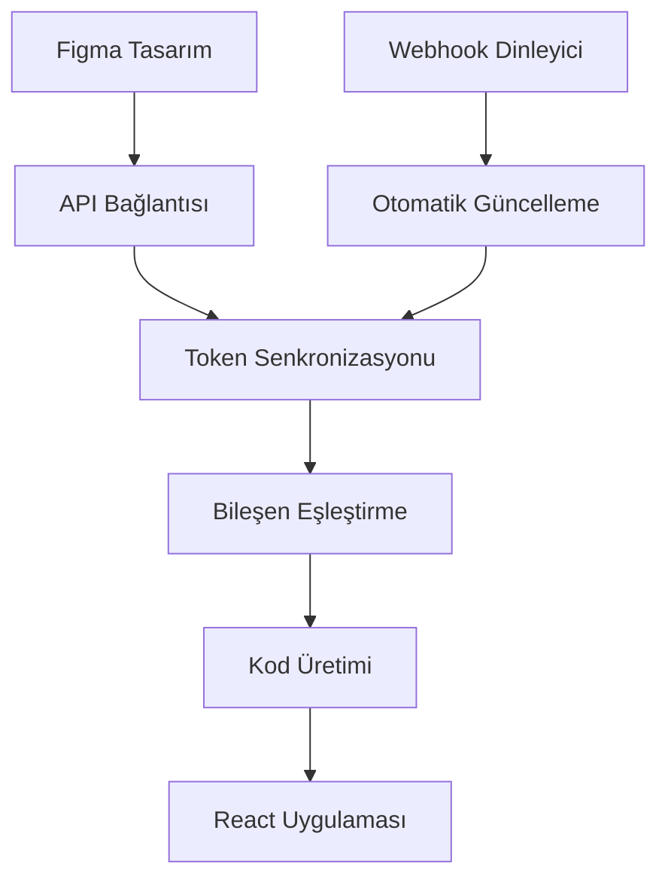
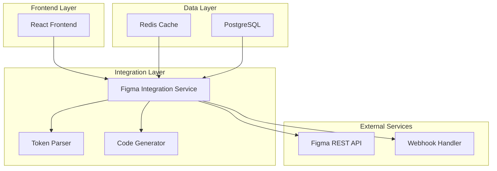
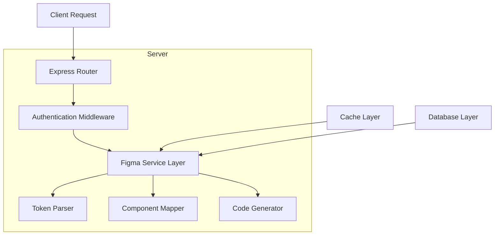
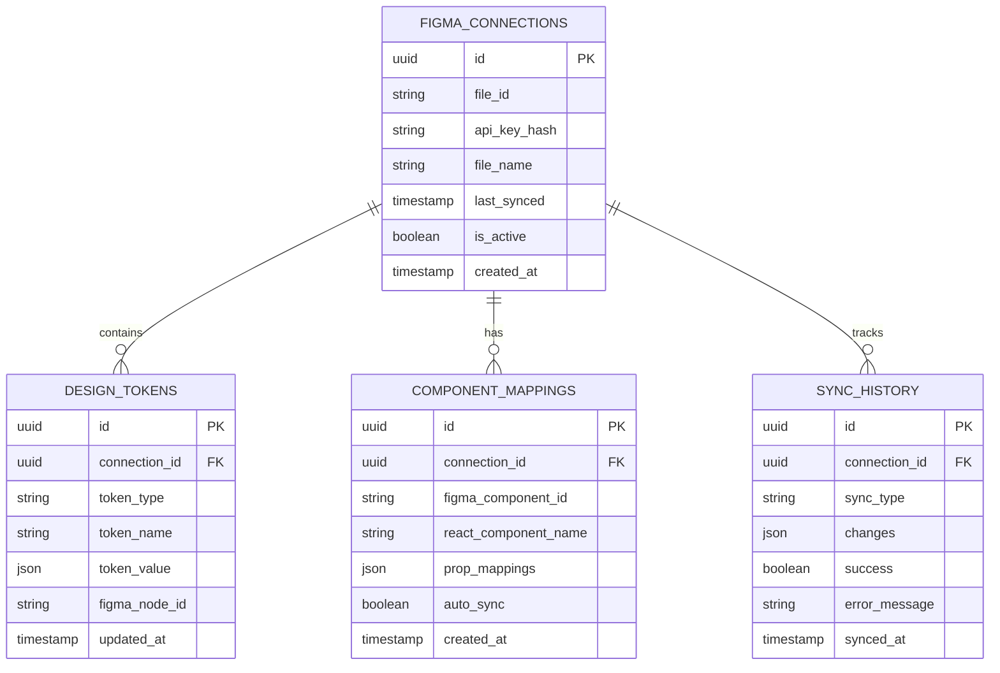

# Figma Entegrasyon Teknik Dokümantasyonu

## 1. Proje Genel Bakış

Bu dokümantasyon, mevcut React TypeScript borsa analizi uygulamasına Figma entegrasyonu eklenmesi için kapsamlı bir teknik rehber sunmaktadır. Entegrasyon, tasarım sisteminin otomatikleştirilmesi, bileşen senkronizasyonu ve geliştirici deneyiminin iyileştirilmesi amacıyla tasarlanmıştır.

## 2. Temel Özellikler

### 2.1 Kullanıcı Rolleri

| Rol | Kayıt Yöntemi | Temel Yetkiler |
|-----|---------------|----------------|
| UI/UX Tasarımcı | Figma hesabı bağlantısı | Tasarım dosyalarını yönetme, token'ları güncelleme |
| Frontend Geliştirici | GitHub/Email kayıt | Figma tasarımlarını kod olarak alma, bileşen senkronizasyonu |
| Proje Yöneticisi | Admin davet kodu | Tüm entegrasyon ayarlarını yönetme, API anahtarlarını kontrol etme |

### 2.2 Özellik Modülleri

Figma entegrasyon sistemi aşağıdaki ana sayfalardan oluşmaktadır:

1. **Figma Bağlantı Sayfası**: API anahtarı yapılandırması, dosya bağlantısı kurulumu
2. **Tasarım Token Yönetimi**: Renk, tipografi, spacing token'larının senkronizasyonu
3. **Bileşen Eşleştirme**: Figma bileşenlerinin React bileşenleriyle eşleştirilmesi
4. **Kod Üretim Paneli**: Otomatik kod üretimi ve önizleme
5. **Senkronizasyon Kontrol Paneli**: Gerçek zamanlı güncellemeler ve versiyon kontrolü

### 2.3 Sayfa Detayları

| Sayfa Adı | Modül Adı | Özellik Açıklaması |
|-----------|-----------|--------------------|
| Figma Bağlantı | API Yapılandırması | Figma API anahtarı girişi, dosya URL'si bağlantısı, bağlantı durumu kontrolü |
| Figma Bağlantı | Dosya Seçimi | Figma dosyalarını listeleme, aktif dosya seçimi, sayfa filtreleme |
| Tasarım Token Yönetimi | Token Senkronizasyonu | Figma'dan token'ları çekme, CSS değişkenlerine dönüştürme, otomatik güncelleme |
| Tasarım Token Yönetimi | Token Önizleme | Token değişikliklerini canlı önizleme, karşılaştırma görünümü |
| Bileşen Eşleştirme | Bileşen Tarama | Figma bileşenlerini otomatik tespit etme, React bileşenleriyle eşleştirme |
| Bileşen Eşleştirme | Mapping Editörü | Manuel eşleştirme düzenleme, özel prop mapping'i, validation kuralları |
| Kod Üretim | Otomatik Kod Üretimi | Figma tasarımlarından React TSX kodu üretme, TypeScript tip tanımları |
| Kod Üretim | Kod Önizleme | Üretilen kodun önizlemesi, syntax highlighting, kopyalama |
| Senkronizasyon Kontrol | Gerçek Zamanlı İzleme | Figma değişikliklerini webhook ile takip etme, otomatik güncelleme |
| Senkronizasyon Kontrol | Versiyon Kontrolü | Tasarım versiyonlarını takip etme, geri alma işlemleri |

## 3. Temel Süreç

### Tasarımcı Akışı:
1. Tasarımcı Figma'da tasarım token'larını ve bileşenleri oluşturur
2. Figma API anahtarını sisteme ekler ve dosyayı bağlar
3. Token'ları ve bileşenleri sisteme senkronize eder
4. Değişiklikleri gerçek zamanlı olarak geliştiricilerle paylaşır

### Geliştirici Akışı:
1. Geliştirici senkronize edilmiş token'ları ve bileşenleri görüntüler
2. Figma bileşenlerini React bileşenleriyle eşleştirir
3. Otomatik kod üretimi ile TSX kodunu alır
4. Üretilen kodu mevcut projeye entegre eder



## 4. Kullanıcı Arayüzü Tasarımı

### 4.1 Tasarım Stili

- **Ana Renkler**: 
  - Primary: #1E40AF (Figma mavi)
  - Secondary: #059669 (Başarı yeşili)
  - Accent: #DC2626 (Hata kırmızısı)
- **Buton Stili**: Rounded corners (8px), subtle shadows, hover animations
- **Font**: Inter font family, 14px base size, 16px headings
- **Layout**: Card-based design, sidebar navigation, responsive grid system
- **İkonlar**: Lucide React icons, Figma brand icons, 20px standard size

### 4.2 Sayfa Tasarım Genel Bakışı

| Sayfa Adı | Modül Adı | UI Elementleri |
|-----------|-----------|----------------|
| Figma Bağlantı | API Yapılandırması | Input field (API key), URL input, connection status badge, test connection button |
| Tasarım Token Yönetimi | Token Listesi | Token cards, color swatches, typography samples, sync status indicators |
| Bileşen Eşleştirme | Mapping Interface | Drag-drop interface, component preview cards, mapping lines, validation icons |
| Kod Üretim | Code Editor | Syntax highlighted code blocks, copy buttons, download options, preview tabs |
| Senkronizasyon Kontrol | Dashboard | Real-time status widgets, activity timeline, version comparison tables |

### 4.3 Responsive Tasarım

Masaüstü öncelikli tasarım, tablet ve mobil uyumlu responsive layout. Touch interaction optimizasyonu dahil.

## 5. Teknik Mimari

### 5.1 Mimari Tasarım



### 5.2 Teknoloji Açıklaması

- **Frontend**: React@18 + TypeScript + TailwindCSS + Vite
- **Backend**: Express@4 + TypeScript
- **Database**: Supabase (PostgreSQL)
- **Cache**: Redis (token ve API response cache)
- **External APIs**: Figma REST API, Figma Webhooks

### 5.3 Route Tanımları

| Route | Amaç |
|-------|-------|
| /figma/connect | Figma API bağlantısı ve yapılandırma sayfası |
| /figma/tokens | Tasarım token yönetimi ve senkronizasyon |
| /figma/components | Bileşen eşleştirme ve mapping editörü |
| /figma/codegen | Otomatik kod üretimi ve önizleme |
| /figma/sync | Senkronizasyon kontrol paneli ve ayarları |
| /figma/settings | Figma entegrasyon genel ayarları |

### 5.4 API Tanımları

#### 5.4.1 Figma API Entegrasyonu

**Figma dosya bilgilerini getirme**
```
GET /api/figma/files/:fileId
```

Request:
| Param Adı | Param Tipi | Zorunlu | Açıklama |
|-----------|------------|---------|----------|
| fileId | string | true | Figma dosya ID'si |
| apiKey | string | true | Figma API anahtarı (header) |

Response:
| Param Adı | Param Tipi | Açıklama |
|-----------|------------|----------|
| name | string | Dosya adı |
| lastModified | string | Son değişiklik tarihi |
| thumbnailUrl | string | Dosya thumbnail URL'si |
| components | array | Bileşen listesi |

**Tasarım token'larını çekme**
```
POST /api/figma/tokens/sync
```

Request:
```json
{
  "fileId": "abc123",
  "nodeIds": ["1:2", "1:3"],
  "tokenTypes": ["colors", "typography", "spacing"]
}
```

Response:
```json
{
  "tokens": {
    "colors": {
      "primary": "#1E40AF",
      "secondary": "#059669"
    },
    "typography": {
      "heading": {
        "fontSize": "24px",
        "fontWeight": "600"
      }
    }
  },
  "syncedAt": "2024-01-15T10:30:00Z"
}
```

#### 5.4.2 Kod Üretimi API

**React bileşeni üretme**
```
POST /api/figma/codegen/component
```

Request:
| Param Adı | Param Tipi | Zorunlu | Açıklama |
|-----------|------------|---------|----------|
| nodeId | string | true | Figma node ID'si |
| componentName | string | true | React bileşen adı |
| includeTypes | boolean | false | TypeScript tip tanımları dahil et |

Response:
| Param Adı | Param Tipi | Açıklama |
|-----------|------------|----------|
| code | string | Üretilen TSX kodu |
| types | string | TypeScript tip tanımları |
| dependencies | array | Gerekli npm paketleri |

### 5.5 Sunucu Mimarisi



### 5.6 Veri Modeli

#### 5.6.1 Veri Modeli Tanımı



#### 5.6.2 Veri Tanım Dili

**Figma Bağlantıları Tablosu (figma_connections)**
```sql
-- Tablo oluşturma
CREATE TABLE figma_connections (
    id UUID PRIMARY KEY DEFAULT gen_random_uuid(),
    file_id VARCHAR(255) NOT NULL,
    api_key_hash VARCHAR(255) NOT NULL,
    file_name VARCHAR(255) NOT NULL,
    last_synced TIMESTAMP WITH TIME ZONE,
    is_active BOOLEAN DEFAULT true,
    created_at TIMESTAMP WITH TIME ZONE DEFAULT NOW(),
    updated_at TIMESTAMP WITH TIME ZONE DEFAULT NOW()
);

-- İndeks oluşturma
CREATE INDEX idx_figma_connections_file_id ON figma_connections(file_id);
CREATE INDEX idx_figma_connections_active ON figma_connections(is_active);

-- Başlangıç verisi
INSERT INTO figma_connections (file_id, api_key_hash, file_name)
VALUES ('sample_file_id', 'hashed_api_key', 'Stock Analysis Design System');
```

**Tasarım Token'ları Tablosu (design_tokens)**
```sql
-- Tablo oluşturma
CREATE TABLE design_tokens (
    id UUID PRIMARY KEY DEFAULT gen_random_uuid(),
    connection_id UUID REFERENCES figma_connections(id) ON DELETE CASCADE,
    token_type VARCHAR(50) NOT NULL CHECK (token_type IN ('colors', 'typography', 'spacing', 'shadows')),
    token_name VARCHAR(255) NOT NULL,
    token_value JSONB NOT NULL,
    figma_node_id VARCHAR(255),
    updated_at TIMESTAMP WITH TIME ZONE DEFAULT NOW()
);

-- İndeks oluşturma
CREATE INDEX idx_design_tokens_connection ON design_tokens(connection_id);
CREATE INDEX idx_design_tokens_type ON design_tokens(token_type);
CREATE INDEX idx_design_tokens_name ON design_tokens(token_name);

-- Başlangıç verisi
INSERT INTO design_tokens (connection_id, token_type, token_name, token_value)
VALUES 
  ((SELECT id FROM figma_connections LIMIT 1), 'colors', 'primary', '{"hex": "#1E40AF", "rgb": "30, 64, 175"}'),
  ((SELECT id FROM figma_connections LIMIT 1), 'typography', 'heading-lg', '{"fontSize": "24px", "fontWeight": "600", "lineHeight": "1.2"}');
```

**Bileşen Eşleştirmeleri Tablosu (component_mappings)**
```sql
-- Tablo oluşturma
CREATE TABLE component_mappings (
    id UUID PRIMARY KEY DEFAULT gen_random_uuid(),
    connection_id UUID REFERENCES figma_connections(id) ON DELETE CASCADE,
    figma_component_id VARCHAR(255) NOT NULL,
    react_component_name VARCHAR(255) NOT NULL,
    prop_mappings JSONB DEFAULT '{}',
    auto_sync BOOLEAN DEFAULT false,
    created_at TIMESTAMP WITH TIME ZONE DEFAULT NOW(),
    updated_at TIMESTAMP WITH TIME ZONE DEFAULT NOW()
);

-- İndeks oluşturma
CREATE INDEX idx_component_mappings_connection ON component_mappings(connection_id);
CREATE INDEX idx_component_mappings_figma_id ON component_mappings(figma_component_id);

-- Başlangıç verisi
INSERT INTO component_mappings (connection_id, figma_component_id, react_component_name, prop_mappings)
VALUES ((SELECT id FROM figma_connections LIMIT 1), '1:123', 'StockCard', '{"title": "text", "price": "value", "change": "percentage"}');
```

**Senkronizasyon Geçmişi Tablosu (sync_history)**
```sql
-- Tablo oluşturma
CREATE TABLE sync_history (
    id UUID PRIMARY KEY DEFAULT gen_random_uuid(),
    connection_id UUID REFERENCES figma_connections(id) ON DELETE CASCADE,
    sync_type VARCHAR(50) NOT NULL CHECK (sync_type IN ('tokens', 'components', 'full')),
    changes JSONB DEFAULT '{}',
    success BOOLEAN NOT NULL,
    error_message TEXT,
    synced_at TIMESTAMP WITH TIME ZONE DEFAULT NOW()
);

-- İndeks oluşturma
CREATE INDEX idx_sync_history_connection ON sync_history(connection_id);
CREATE INDEX idx_sync_history_date ON sync_history(synced_at DESC);
CREATE INDEX idx_sync_history_success ON sync_history(success);

-- Başlangıç verisi
INSERT INTO sync_history (connection_id, sync_type, success, changes)
VALUES ((SELECT id FROM figma_connections LIMIT 1), 'tokens', true, '{"updated": 5, "added": 2, "removed": 0}');
```

## 6. Uygulama Yol Haritası

### Faz 1: Temel Entegrasyon (2-3 hafta)
- Figma API bağlantısı kurulumu
- Temel token senkronizasyonu
- Basit bileşen eşleştirme
- Minimal UI implementasyonu

### Faz 2: Gelişmiş Özellikler (3-4 hafta)
- Otomatik kod üretimi
- Gerçek zamanlı webhook entegrasyonu
- Gelişmiş bileşen mapping editörü
- Kapsamlı UI/UX iyileştirmeleri

### Faz 3: Optimizasyon ve Otomasyon (2-3 hafta)
- Performans optimizasyonları
- Otomatik deployment entegrasyonu
- Gelişmiş hata yönetimi
- Kullanıcı deneyimi iyileştirmeleri

### Faz 4: Gelişmiş Entegrasyon (3-4 hafta)
- Design system versiyonlama
- Çoklu Figma dosyası desteği
- Gelişmiş analytics ve raporlama
- Enterprise özellikler

## 7. Güvenlik ve API Yönetimi

### 7.1 API Anahtarı Güvenliği
- API anahtarları şifrelenmiş olarak saklanır
- Environment variables ile güvenli yapılandırma
- Rate limiting ve API quota yönetimi
- Webhook signature doğrulaması

### 7.2 Veri Güvenliği
- HTTPS zorunlu iletişim
- Hassas verilerin şifrelenmesi
- Audit log kayıtları
- Kullanıcı yetkilendirme sistemi

## 8. Performans ve Ölçeklenebilirlik

### 8.1 Cache Stratejisi
- Redis ile API response cache
- Token değişikliklerinin intelligent cache invalidation
- CDN entegrasyonu statik assets için

### 8.2 Optimizasyon
- Lazy loading bileşenleri
- Debounced API çağrıları
- Batch processing büyük senkronizasyonlar için
- Background job processing

Bu dokümantasyon, mevcut borsa analizi uygulamasına Figma entegrasyonu eklenmesi için kapsamlı bir teknik rehber sunmaktadır. Implementasyon sırasında her fazın detaylı planlaması ve test stratejileri ayrıca geliştirilmelidir.