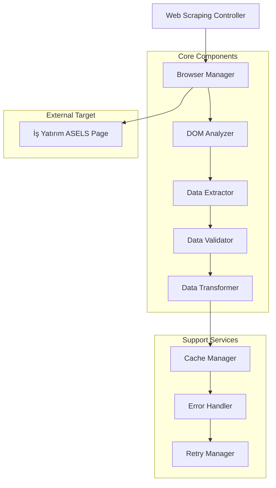
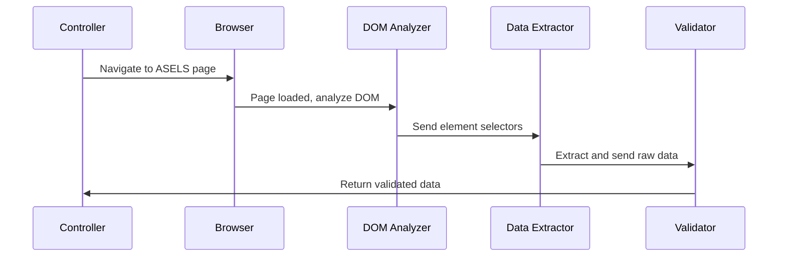

# İş Yatırım Web Scraping Mimarisi

## 1. Proje Genel Bakış

İş Yatırım ASELS şirket kartı sayfasından finansal verilerin otomatik olarak çekilmesi için tasarlanmış kapsamlı web scraping mimarisi. API kullanımı olmadan doğrudan web sayfası DOM yapısını analiz ederek finansal bilgileri güvenli ve verimli şekilde çıkarır.

## 2. Mimari Tasarım



## 3. Teknoloji Açıklaması

- **Frontend**: React@18 + TypeScript + Tailwind CSS
- **Backend**: Node.js + Express + Puppeteer
- **Web Scraping**: Puppeteer + Cheerio
- **Veri İşleme**: Custom parsers + validators
- **Önbellekleme**: Memory cache + File system
- **Hata Yönetimi**: Custom retry mechanisms

## 4. Temel Bileşenler

### 4.1 Browser Manager
**Amaç**: Puppeteer tarayıcı örneklerini yönetir ve sayfa navigasyonunu kontrol eder.

**Özellikler**:
- Headless Chrome yönetimi
- User-Agent rotasyonu
- Viewport ayarları
- Cookie yönetimi
- Proxy desteği

### 4.2 DOM Analyzer
**Amaç**: Sayfa yapısını analiz eder ve veri konumlarını tespit eder.

**Özellikler**:
- CSS selector tespiti
- XPath analizi
- Dinamik içerik bekleme
- Element görünürlük kontrolü

### 4.3 Data Extractor
**Amaç**: Tespit edilen elementlerden finansal verileri çıkarır.

**Özellikler**:
- Metin çıkarma
- Sayısal değer parsing
- Tablo verisi işleme
- Nested element handling

### 4.4 Data Validator
**Amaç**: Çıkarılan verilerin doğruluğunu ve bütünlüğünü kontrol eder.

**Özellikler**:
- Veri tipi kontrolü
- Değer aralığı validasyonu
- Zorunlu alan kontrolü
- Format doğrulama

### 4.5 Error Handler & Retry Manager
**Amaç**: Hataları yönetir ve yeniden deneme stratejilerini uygular.

**Özellikler**:
- Exponential backoff
- Circuit breaker pattern
- Hata kategorilendirme
- Logging ve monitoring

## 5. Veri Çıkarma Stratejisi

### 5.1 Hedef Veri Alanları

| Veri Kategorisi | Hedef Alanlar | CSS Selectors |
|----------------|---------------|---------------|
| Temel Bilgiler | Şirket adı, kod, sektör | `.company-info`, `.sector-info` |
| Finansal Oranlar | P/E, P/B, ROE, ROA | `.financial-ratios table` |
| Bilanço Verileri | Aktif, pasif, özkaynak | `.balance-sheet .data-row` |
| Gelir Tablosu | Net satışlar, kar/zarar | `.income-statement .amount` |
| Piyasa Verileri | Fiyat, hacim, piyasa değeri | `.market-data .price-info` |

### 5.2 Veri Çıkarma Süreci



## 6. Hata Yönetimi ve Yeniden Deneme

### 6.1 Hata Kategorileri

| Hata Tipi | Açıklama | Strateji |
|-----------|----------|----------|
| Network Error | Bağlantı sorunları | 3x retry with backoff |
| Page Load Error | Sayfa yüklenme hatası | User-agent rotation |
| Element Not Found | DOM element bulunamadı | Alternative selector |
| Data Parse Error | Veri parsing hatası | Fallback parser |
| Rate Limiting | Çok fazla istek | Delay + proxy rotation |

### 6.2 Retry Mekanizması

```typescript
interface RetryConfig {
  maxAttempts: number;
  baseDelay: number;
  maxDelay: number;
  backoffMultiplier: number;
  retryableErrors: string[];
}

const defaultRetryConfig: RetryConfig = {
  maxAttempts: 3,
  baseDelay: 1000,
  maxDelay: 10000,
  backoffMultiplier: 2,
  retryableErrors: ['NETWORK_ERROR', 'TIMEOUT', 'RATE_LIMIT']
};
```

## 7. Performans Optimizasyonu

### 7.1 Önbellekleme Stratejisi

- **Memory Cache**: Sık kullanılan selectors ve parsing rules
- **File Cache**: Günlük veri snapshots
- **Browser Cache**: Static resources (CSS, JS)
- **TTL Policy**: 1 saat için fresh data, 24 saat için fallback

### 7.2 Paralel İşleme

- **Browser Pool**: 3-5 concurrent browser instances
- **Queue Management**: Request queuing with priority
- **Resource Limiting**: CPU ve memory usage monitoring

### 7.3 Optimizasyon Teknikleri

- **Selective Loading**: Sadece gerekli resources yükleme
- **Image Blocking**: Görsel içerikleri devre dışı bırakma
- **JavaScript Optimization**: Minimal JS execution
- **CSS Optimization**: Critical CSS only

## 8. Güvenlik Önlemleri

### 8.1 Anti-Detection Stratejileri

- **User-Agent Rotation**: Gerçek tarayıcı user-agents kullanımı
- **Request Timing**: İnsan benzeri request intervals
- **Viewport Randomization**: Farklı ekran çözünürlükleri
- **Cookie Management**: Session persistence

### 8.2 Rate Limiting

```typescript
interface RateLimitConfig {
  requestsPerMinute: number;
  burstLimit: number;
  cooldownPeriod: number;
}

const rateLimitConfig: RateLimitConfig = {
  requestsPerMinute: 10,
  burstLimit: 3,
  cooldownPeriod: 60000
};
```

### 8.3 Proxy ve IP Yönetimi

- **Proxy Rotation**: Multiple proxy endpoints
- **IP Whitelisting**: Güvenilir IP ranges
- **Geographic Distribution**: Farklı lokasyonlardan erişim

## 9. Veri Modeli

### 9.1 Çıkarılan Veri Yapısı

```typescript
interface ASELSFinancialData {
  companyInfo: {
    name: string;
    code: string;
    sector: string;
    lastUpdate: Date;
  };
  marketData: {
    currentPrice: number;
    volume: number;
    marketCap: number;
    priceChange: number;
    priceChangePercent: number;
  };
  financialRatios: {
    peRatio: number;
    pbRatio: number;
    roe: number;
    roa: number;
    debtToEquity: number;
  };
  balanceSheet: {
    totalAssets: number;
    totalLiabilities: number;
    equity: number;
    cash: number;
    debt: number;
  };
  incomeStatement: {
    revenue: number;
    netIncome: number;
    grossProfit: number;
    operatingIncome: number;
    ebitda: number;
  };
}
```

### 9.2 Veri Validasyon Kuralları

```typescript
interface ValidationRules {
  required: string[];
  numericFields: string[];
  rangeValidation: Record<string, {min: number; max: number}>;
  formatValidation: Record<string, RegExp>;
}

const validationRules: ValidationRules = {
  required: ['companyInfo.name', 'companyInfo.code', 'marketData.currentPrice'],
  numericFields: ['marketData.currentPrice', 'financialRatios.peRatio'],
  rangeValidation: {
    'marketData.currentPrice': {min: 0, max: 10000},
    'financialRatios.peRatio': {min: 0, max: 1000}
  },
  formatValidation: {
    'companyInfo.code': /^[A-Z]{3,6}$/
  }
};
```

## 10. İmplementasyon Yapısı

### 10.1 Modüler Bileşen Yapısı

```
src/
├── scrapers/
│   ├── isYatirimScraper.ts
│   ├── browserManager.ts
│   ├── domAnalyzer.ts
│   └── dataExtractor.ts
├── validators/
│   ├── dataValidator.ts
│   └── schemaValidator.ts
├── utils/
│   ├── retryManager.ts
│   ├── cacheManager.ts
│   └── errorHandler.ts
├── config/
│   ├── scrapingConfig.ts
│   └── selectors.ts
└── types/
    ├── financialData.ts
    └── scrapingTypes.ts
```

### 10.2 Ana Scraper Sınıfı

```typescript
class IsYatirimScraper {
  private browserManager: BrowserManager;
  private domAnalyzer: DOMAnalyzer;
  private dataExtractor: DataExtractor;
  private validator: DataValidator;
  private retryManager: RetryManager;
  
  async scrapeASELSData(): Promise<ASELSFinancialData> {
    const page = await this.browserManager.createPage();
    
    try {
      await page.goto(ASELS_URL, {waitUntil: 'networkidle2'});
      
      const selectors = await this.domAnalyzer.analyzePageStructure(page);
      const rawData = await this.dataExtractor.extractData(page, selectors);
      const validatedData = await this.validator.validate(rawData);
      
      return validatedData;
    } catch (error) {
      return this.retryManager.handleError(error, () => this.scrapeASELSData());
    } finally {
      await page.close();
    }
  }
}
```

## 11. Monitoring ve Logging

### 11.1 Performans Metrikleri

- **Scraping Success Rate**: Başarılı veri çekme oranı
- **Average Response Time**: Ortalama yanıt süresi
- **Error Rate by Type**: Hata tiplerine göre dağılım
- **Data Quality Score**: Veri kalite puanı

### 11.2 Alerting Sistemi

- **High Error Rate**: %20 üzeri hata oranı
- **Slow Response**: 30 saniye üzeri yanıt süresi
- **Data Quality Issues**: Eksik veya hatalı veri
- **Rate Limiting**: IP blocking detection

## 12. Deployment ve Maintenance

### 12.1 Deployment Stratejisi

- **Containerization**: Docker containers
- **Orchestration**: Kubernetes deployment
- **Auto-scaling**: Load-based scaling
- **Health Checks**: Endpoint monitoring

### 12.2 Maintenance Planı

- **Daily**: Error log review
- **Weekly**: Performance metrics analysis
- **Monthly**: Selector validation ve update
- **Quarterly**: Security audit ve penetration testing

Bu mimari, İş Yatırım ASELS sayfasından güvenilir, verimli ve sürdürülebilir veri çekme işlemlerini sağlamak için tasarlanmıştır.