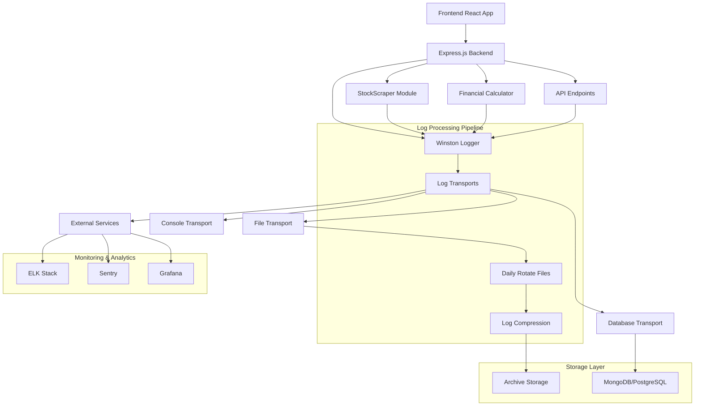
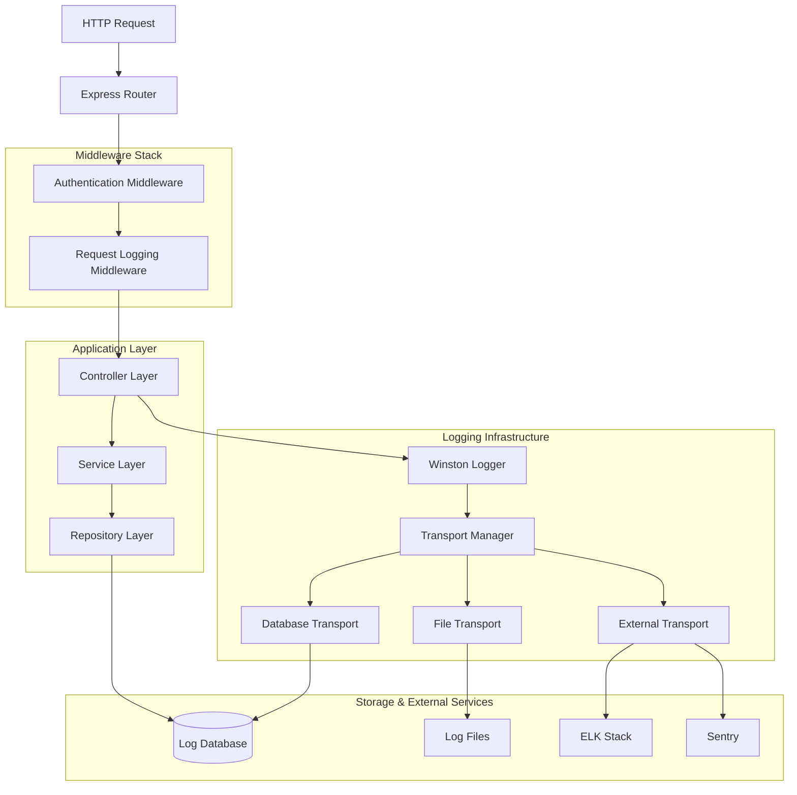
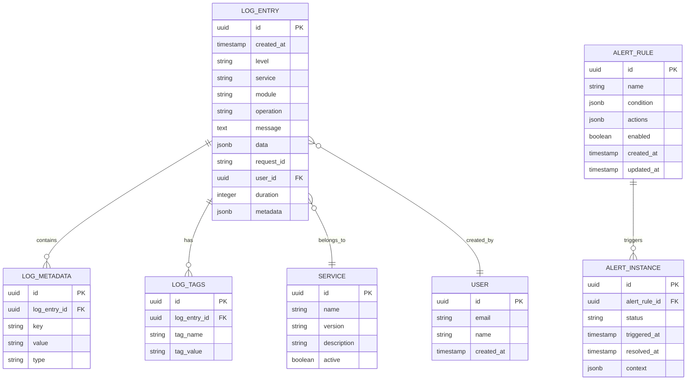

# Loglama Sistemi Teknik Mimari Dokümantasyonu

## 1. Mimari Tasarım



## 2. Teknoloji Açıklaması

- **Frontend**: React@18 + Axios (log gönderimi için)
- **Backend**: Express@4 + Winston@3 + Morgan (HTTP logging)
- **Log Transport**: winston-daily-rotate-file, winston-mongodb
- **Monitoring**: ELK Stack (Elasticsearch, Logstash, Kibana)
- **Alerting**: Grafana + Prometheus + AlertManager
- **Error Tracking**: Sentry
- **Storage**: File System + MongoDB/PostgreSQL
- **Compression**: gzip, winston-daily-rotate-file

## 3. Route Tanımları

| Route | Amaç |
|-------|-------|
| /api/logs | Log kayıtlarını sorgulama ve filtreleme |
| /api/logs/search | Log kayıtlarında arama yapma |
| /api/logs/export | Log kayıtlarını export etme |
| /api/health | Sistem sağlık durumu ve log sistemi durumu |
| /api/metrics | Prometheus formatında metrikler |
| /api/alerts | Alert konfigürasyonu ve durumu |

## 4. API Tanımları

### 4.1 Log Sorgulama API

**Log kayıtlarını getirme**
```
GET /api/logs
```

Request:
| Parametre | Tip | Zorunlu | Açıklama |
|-----------|-----|---------|----------|
| level | string | false | Log seviyesi (error, warn, info, debug) |
| service | string | false | Servis adı (stockScraper, calculator) |
| startDate | string | false | Başlangıç tarihi (ISO 8601) |
| endDate | string | false | Bitiş tarihi (ISO 8601) |
| limit | number | false | Maksimum kayıt sayısı (varsayılan: 100) |
| offset | number | false | Sayfa offset (varsayılan: 0) |

Response:
| Parametre | Tip | Açıklama |
|-----------|-----|----------|
| logs | array | Log kayıtları dizisi |
| total | number | Toplam kayıt sayısı |
| hasMore | boolean | Daha fazla kayıt var mı |

Örnek:
```json
{
  "logs": [
    {
      "timestamp": "2025-01-27T10:30:45.123Z",
      "level": "info",
      "service": "stockScraper",
      "message": "Stock data fetched successfully",
      "data": {
        "symbol": "THYAO",
        "price": 125.50
      }
    }
  ],
  "total": 1500,
  "hasMore": true
}
```

**Log arama**
```
POST /api/logs/search
```

Request:
| Parametre | Tip | Zorunlu | Açıklama |
|-----------|-----|---------|----------|
| query | string | true | Arama sorgusu |
| filters | object | false | Filtreleme kriterleri |
| timeRange | object | false | Zaman aralığı |

Örnek:
```json
{
  "query": "THYAO AND error",
  "filters": {
    "level": ["error", "warn"],
    "service": "stockScraper"
  },
  "timeRange": {
    "start": "2025-01-27T00:00:00Z",
    "end": "2025-01-27T23:59:59Z"
  }
}
```

### 4.2 Metrik API

**Sistem metrikleri**
```
GET /api/metrics
```

Response:
```
# HELP log_entries_total Total number of log entries
# TYPE log_entries_total counter
log_entries_total{level="info",service="stockScraper"} 1500
log_entries_total{level="error",service="stockScraper"} 25

# HELP log_processing_duration_seconds Time spent processing logs
# TYPE log_processing_duration_seconds histogram
log_processing_duration_seconds_bucket{le="0.1"} 100
log_processing_duration_seconds_bucket{le="0.5"} 450
log_processing_duration_seconds_bucket{le="1.0"} 800
```

### 4.3 Alert API

**Alert konfigürasyonu**
```
POST /api/alerts/configure
```

Request:
| Parametre | Tip | Zorunlu | Açıklama |
|-----------|-----|---------|----------|
| name | string | true | Alert adı |
| condition | object | true | Alert koşulu |
| actions | array | true | Alert aksiyonları |
| enabled | boolean | false | Alert aktif mi |

Örnek:
```json
{
  "name": "High Error Rate",
  "condition": {
    "metric": "error_rate",
    "operator": ">",
    "threshold": 0.05,
    "timeWindow": "5m"
  },
  "actions": [
    {
      "type": "email",
      "recipients": ["admin@company.com"]
    },
    {
      "type": "slack",
      "channel": "#alerts"
    }
  ],
  "enabled": true
}
```

## 5. Sunucu Mimarisi



## 6. Veri Modeli

### 6.1 Veri Modeli Tanımı



### 6.2 Veri Tanımlama Dili (DDL)

**Log Entry Tablosu**
```sql
-- Log kayıtları ana tablosu
CREATE TABLE log_entries (
    id UUID PRIMARY KEY DEFAULT gen_random_uuid(),
    created_at TIMESTAMP WITH TIME ZONE DEFAULT NOW(),
    level VARCHAR(10) NOT NULL CHECK (level IN ('error', 'warn', 'info', 'debug', 'trace')),
    service VARCHAR(50) NOT NULL,
    module VARCHAR(50),
    operation VARCHAR(100),
    message TEXT NOT NULL,
    data JSONB,
    request_id VARCHAR(100),
    user_id UUID,
    duration INTEGER, -- milisaniye cinsinden
    metadata JSONB,
    CONSTRAINT fk_log_user FOREIGN KEY (user_id) REFERENCES users(id)
);

-- İndeksler
CREATE INDEX idx_log_entries_created_at ON log_entries(created_at DESC);
CREATE INDEX idx_log_entries_level ON log_entries(level);
CREATE INDEX idx_log_entries_service ON log_entries(service);
CREATE INDEX idx_log_entries_request_id ON log_entries(request_id);
CREATE INDEX idx_log_entries_user_id ON log_entries(user_id);
CREATE INDEX idx_log_entries_data_gin ON log_entries USING GIN(data);
CREATE INDEX idx_log_entries_metadata_gin ON log_entries USING GIN(metadata);

-- Partitioning (aylık)
CREATE TABLE log_entries_y2025m01 PARTITION OF log_entries
FOR VALUES FROM ('2025-01-01') TO ('2025-02-01');

CREATE TABLE log_entries_y2025m02 PARTITION OF log_entries
FOR VALUES FROM ('2025-02-01') TO ('2025-03-01');
```

**Log Metadata Tablosu**
```sql
-- Log metadata tablosu
CREATE TABLE log_metadata (
    id UUID PRIMARY KEY DEFAULT gen_random_uuid(),
    log_entry_id UUID NOT NULL,
    key VARCHAR(100) NOT NULL,
    value TEXT,
    type VARCHAR(20) DEFAULT 'string',
    CONSTRAINT fk_metadata_log FOREIGN KEY (log_entry_id) REFERENCES log_entries(id) ON DELETE CASCADE
);

CREATE INDEX idx_log_metadata_log_entry_id ON log_metadata(log_entry_id);
CREATE INDEX idx_log_metadata_key ON log_metadata(key);
```

**Services Tablosu**
```sql
-- Servisler tablosu
CREATE TABLE services (
    id UUID PRIMARY KEY DEFAULT gen_random_uuid(),
    name VARCHAR(50) UNIQUE NOT NULL,
    version VARCHAR(20),
    description TEXT,
    active BOOLEAN DEFAULT true,
    created_at TIMESTAMP WITH TIME ZONE DEFAULT NOW()
);

-- Başlangıç verileri
INSERT INTO services (name, version, description) VALUES
('stockScraper', '1.0.0', 'Hisse senedi verisi çekme servisi'),
('financialCalculator', '1.0.0', 'Finansal hesaplama servisi'),
('apiGateway', '1.0.0', 'API gateway servisi'),
('userManagement', '1.0.0', 'Kullanıcı yönetim servisi');
```

**Alert Rules Tablosu**
```sql
-- Alert kuralları tablosu
CREATE TABLE alert_rules (
    id UUID PRIMARY KEY DEFAULT gen_random_uuid(),
    name VARCHAR(100) NOT NULL,
    condition JSONB NOT NULL,
    actions JSONB NOT NULL,
    enabled BOOLEAN DEFAULT true,
    created_at TIMESTAMP WITH TIME ZONE DEFAULT NOW(),
    updated_at TIMESTAMP WITH TIME ZONE DEFAULT NOW()
);

-- Alert instances tablosu
CREATE TABLE alert_instances (
    id UUID PRIMARY KEY DEFAULT gen_random_uuid(),
    alert_rule_id UUID NOT NULL,
    status VARCHAR(20) DEFAULT 'active' CHECK (status IN ('active', 'resolved', 'suppressed')),
    triggered_at TIMESTAMP WITH TIME ZONE DEFAULT NOW(),
    resolved_at TIMESTAMP WITH TIME ZONE,
    context JSONB,
    CONSTRAINT fk_alert_rule FOREIGN KEY (alert_rule_id) REFERENCES alert_rules(id)
);

CREATE INDEX idx_alert_instances_rule_id ON alert_instances(alert_rule_id);
CREATE INDEX idx_alert_instances_status ON alert_instances(status);
CREATE INDEX idx_alert_instances_triggered_at ON alert_instances(triggered_at DESC);
```

**Log Aggregation Views**
```sql
-- Günlük log özeti view
CREATE VIEW daily_log_summary AS
SELECT 
    DATE(created_at) as log_date,
    service,
    level,
    COUNT(*) as entry_count,
    AVG(duration) as avg_duration,
    MAX(duration) as max_duration
FROM log_entries 
WHERE created_at >= CURRENT_DATE - INTERVAL '30 days'
GROUP BY DATE(created_at), service, level
ORDER BY log_date DESC, service, level;

-- Hata oranı view
CREATE VIEW error_rate_summary AS
SELECT 
    service,
    DATE_TRUNC('hour', created_at) as hour_bucket,
    COUNT(*) FILTER (WHERE level = 'error') as error_count,
    COUNT(*) as total_count,
    ROUND(
        (COUNT(*) FILTER (WHERE level = 'error')::DECIMAL / COUNT(*)) * 100, 
        2
    ) as error_rate_percent
FROM log_entries 
WHERE created_at >= NOW() - INTERVAL '24 hours'
GROUP BY service, DATE_TRUNC('hour', created_at)
ORDER BY hour_bucket DESC, service;
```

**Stored Procedures**
```sql
-- Log temizleme prosedürü
CREATE OR REPLACE FUNCTION cleanup_old_logs(retention_days INTEGER DEFAULT 30)
RETURNS INTEGER AS $$
DECLARE
    deleted_count INTEGER;
BEGIN
    DELETE FROM log_entries 
    WHERE created_at < NOW() - (retention_days || ' days')::INTERVAL;
    
    GET DIAGNOSTICS deleted_count = ROW_COUNT;
    
    -- Log temizleme işlemini logla
    INSERT INTO log_entries (level, service, operation, message, data)
    VALUES (
        'info',
        'system',
        'cleanup_old_logs',
        'Old logs cleaned up',
        jsonb_build_object(
            'deleted_count', deleted_count,
            'retention_days', retention_days
        )
    );
    
    RETURN deleted_count;
END;
$$ LANGUAGE plpgsql;

-- Günlük temizleme job'ı
SELECT cron.schedule('cleanup-logs', '0 2 * * *', 'SELECT cleanup_old_logs(30);');
```

**Trigger Functions**
```sql
-- Updated_at trigger function
CREATE OR REPLACE FUNCTION update_updated_at_column()
RETURNS TRIGGER AS $$
BEGIN
    NEW.updated_at = NOW();
    RETURN NEW;
END;
$$ LANGUAGE plpgsql;

-- Alert rules için updated_at trigger
CREATE TRIGGER update_alert_rules_updated_at
    BEFORE UPDATE ON alert_rules
    FOR EACH ROW
    EXECUTE FUNCTION update_updated_at_column();
```

Bu teknik mimari dokümantasyonu, loglama sisteminin detaylı implementasyonu için gerekli tüm teknik bileşenleri, veri yapılarını ve API tanımlarını içermektedir.